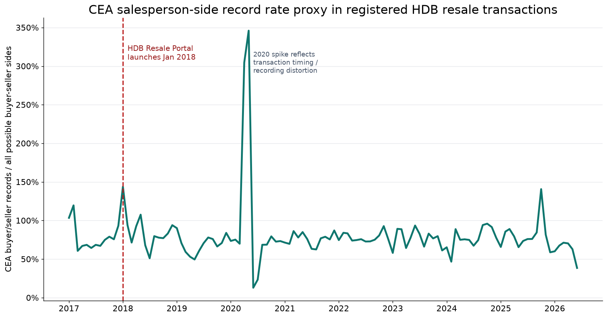
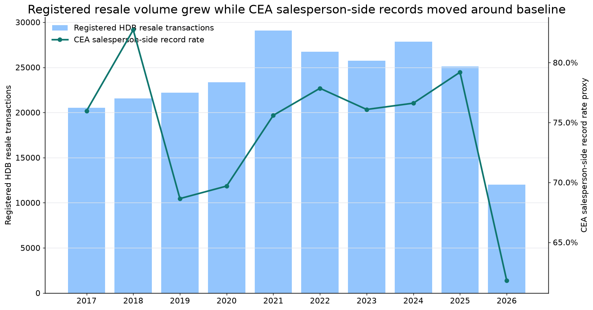
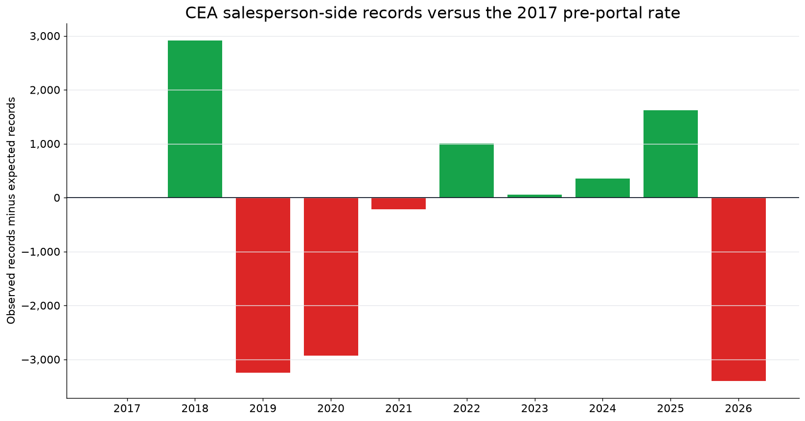
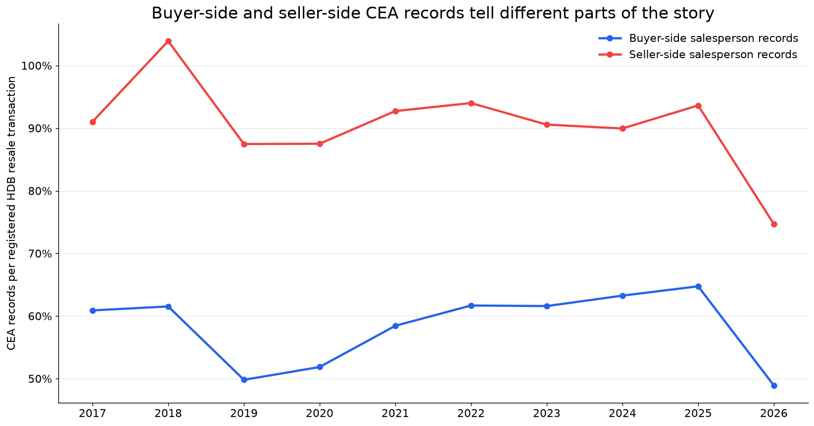
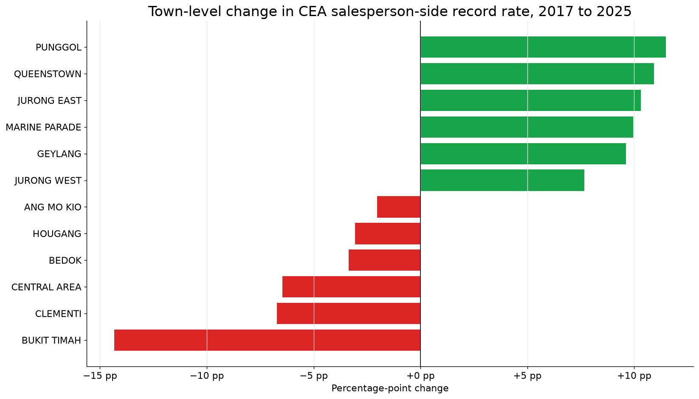

# Did the HDB Resale Portal shrink the role of property agents?


When Singapore launched the HDB Resale Portal in January 2018, it made a simple promise to buyers and sellers: resale transactions should be easier to complete without always needing an intermediary.

That raises a very natural question:

**Did the portal reduce the business opportunity for property agents?**

The short answer from the data is more interesting than a simple yes or no:

> The portal did not create a sustained collapse in agent-related transaction records. Instead, agent involvement appears resilient overall, while the type of value agents provide likely shifted toward situations where buyers and sellers still want professional support.

## The tricky part: one resale flat is not one agent record


This analysis uses two official datasets:

- **HDB resale flat prices from January 2017 onwards**, which counts registered HDB resale transactions.
- **CEA salesperson residential transaction records**, which counts CEA salesperson-side records.

Those two datasets do not count the same thing.

One completed HDB resale transaction can involve:

- no agent,
- an agent on the buyer side,
- an agent on the seller side,
- agents on both sides,
- or, in the raw CEA records, more than one salesperson record around a side or period.

Because there is no shared transaction ID, I do **not** claim to know the exact share of resale flats with at least one agent.

Instead, I use a proxy:

```text
agent-side record rate =
CEA HDB resale buyer/seller salesperson-side records / (2 * registered HDB resale transactions)
```

Think of this as an **agent opportunity index** rather than a perfect agent usage share.

That wording matters. In some periods, CEA records can exceed what a literal “two sides per transaction” interpretation would allow. That does not make the data useless, but it does mean the metric should be read as a **record-rate proxy** rather than an exact penetration rate.

## What happened after January 2018?



The monthly view is noisy. It includes obvious timing distortions, especially around 2020 when registered HDB resale transaction counts were unusually low in some months while CEA salesperson-side records still appeared.

So the cleaner public story should lean on annual patterns.



The 2017 pre-portal baseline was an agent-side record rate of **76.0%**.

By the latest complete year, **2025**, the rate was **79.2%**, about **+3.2 percentage points** above the 2017 baseline.

That does not mean the portal increased agent business. It does mean the data does not support the idea that agent opportunity collapsed after self-service became easier.

It is also important not to overclaim causality. January 2018 is a useful event marker, but housing-market cycles, policy changes, COVID-era timing distortions, interest-rate conditions, and changes in the flat mix also affected resale activity after 2018.

## Quantifying the business impact

To estimate impact, I compare actual CEA buyer/seller salesperson-side records against the number of records we would expect if the 2017 rate had continued.



| Year | Registered HDB resale transactions | CEA salesperson-side records | Record rate | Gap vs 2017-rate expectation |
|---:|---:|---:|---:|---:|
| 2017 | 20,509 | 31,162 | 76.0% | 0 |
| 2018 | 21,561 | 35,674 | 82.7% | +2,914 |
| 2019 | 22,186 | 30,461 | 68.6% | -3,249 |
| 2020 | 23,333 | 32,524 | 69.7% | -2,929 |
| 2021 | 29,087 | 43,978 | 75.6% | -218 |
| 2022 | 26,720 | 41,606 | 77.9% | +1,007 |
| 2023 | 25,754 | 39,191 | 76.1% | +60 |
| 2024 | 27,832 | 42,646 | 76.6% | +357 |
| 2025 | 25,085 | 39,733 | 79.2% | +1,618 |

Across complete post-launch years from **2018 to 2025**, the cumulative gap is about **-440 CEA salesperson-side records** versus the 2017-rate expectation.

That is tiny relative to the size of the resale market over the period. The better reading is:

**The portal may have changed how people use agents, but it did not remove agent-side transaction opportunity at scale.**

## Transaction opportunity is not the same as revenue

The numbers above count transaction records, not dollars.

To estimate commission impact, we would need assumptions about:

- commission rates,
- resale prices,
- whether buyer and seller sides are compensated differently,
- whether each CEA record maps cleanly to paid representation,
- and whether multiple salesperson records relate to one transaction.

For management use, the better approach is scenario analysis:

```text
revenue exposure =
agent-side record gap * median resale price * assumed commission rate
```

For example, a low/base/high case could use illustrative rates such as 0.5%, 1.0%, and 2.0%. That would show the sensitivity of possible revenue exposure without pretending that public transaction records directly reveal agent income.

## Buyers and sellers behave differently



Splitting the records by represented side makes the story clearer.

In 2017:

- buyer-side records were **60.9%** of registered HDB resale transactions,
- seller-side records were **91.0%** of registered HDB resale transactions.

In 2025:

- buyer-side records were **64.8%**,
- seller-side records were **93.6%**.

Seller-side records remain especially high. That makes intuitive sense: sellers may still value agents for pricing, listing, negotiation, buyer filtering, paperwork, and completion support.

## The story differs by town



Town-level changes also vary. Some towns had lower agent-side record rates in 2025 than in 2017, while others increased.

That suggests the next level of analysis should segment by:

- town,
- flat type,
- resale price band,
- lease profile,
- buyer/seller side,
- and possibly market cycle.

In plain English: self-service adoption is unlikely to be uniform. Some transactions are simple enough for DIY. Others still benefit from professional help.

For management execution, this segmentation is the bridge from insight to action. If self-service adoption is stronger in certain towns, flat types, or price bands, the response could be more targeted portal guidance, clearer public education, or deeper study of where agent value remains strongest.

## What this means for the public


The HDB Resale Portal made the resale journey more accessible. That is meaningful.

But the data does not show agents vanishing from the resale market. Instead, it points to a more balanced picture:

- simple transactions may be easier to self-serve,
- agents still appear heavily involved in many buyer and seller sides,
- and the business impact is better measured as a shift in agent opportunity, not a sudden disappearance of agent work.

## Caveats

This is a transaction-record analysis, not a commission-revenue analysis.

The CEA dataset records salesperson-side records, not unique resale deals. Without transaction IDs, we cannot perfectly match CEA rows to registered HDB resale transactions. Commission impact would require extra assumptions about commission rates and resale prices.

The portal launch is also not the only thing that changed after 2018. Housing-market cycles, policy changes, COVID-era disruption, and resale demand all matter.

Partial-year data should also be handled carefully. This dataset extends into 2026, but the latest complete year for annual conclusions is **2025**. Partial-year 2026 data is useful for monitoring, not for a headline annual comparison.

## Future improvements

Several communication improvements would make the story easier to understand, even if they are weaker as management insights than the metric, segmentation, causality, and revenue work above.

First, the public narrative can start with a sharper reader hook: **if DIY became easier, did people actually stop using agents?** That framing is more intuitive than starting with dataset mechanics.

Second, the conclusion can be made more explicit: the evidence points to **resilient CEA salesperson-side records and a likely shift in agent value**, not a simple story of agents being replaced.

Third, the public version should use annual aggregation more prominently than monthly charts. Monthly charts are useful diagnostics, but annual views reduce timing noise and are easier for general readers to interpret.

Finally, annotated visuals and friendly illustrations can improve public perception and comprehension. They do not create stronger evidence by themselves, but they help readers remember the message and understand the measurement caveats.

## Reproducibility notes

The notebook in this repo, `codes/section_1_question_1_hdb_agent_impact.ipynb`, implements the core workflow:

1. Load CEA salesperson residential transaction records.
2. Filter to `property_type == HDB`, `transaction_type == RESALE`, and `represented in BUYER/SELLER`.
3. Load HDB resale flat transactions from January 2017 onwards.
4. Aggregate registered HDB resale transactions and CEA salesperson-side records by month and year.
5. Calculate the agent-side record rate proxy.
6. Compare annual observed records against the 2017 pre-portal baseline.
7. Use complete years for headline conclusions and partial years for monitoring.
8. Add management segmentation and scenario-based revenue exposure where assumptions are clearly stated.

**Bottom line:** the HDB Resale Portal likely made DIY resale transactions easier, but the available public data shows CEA salesperson-side records remained broadly resilient through 2025.
