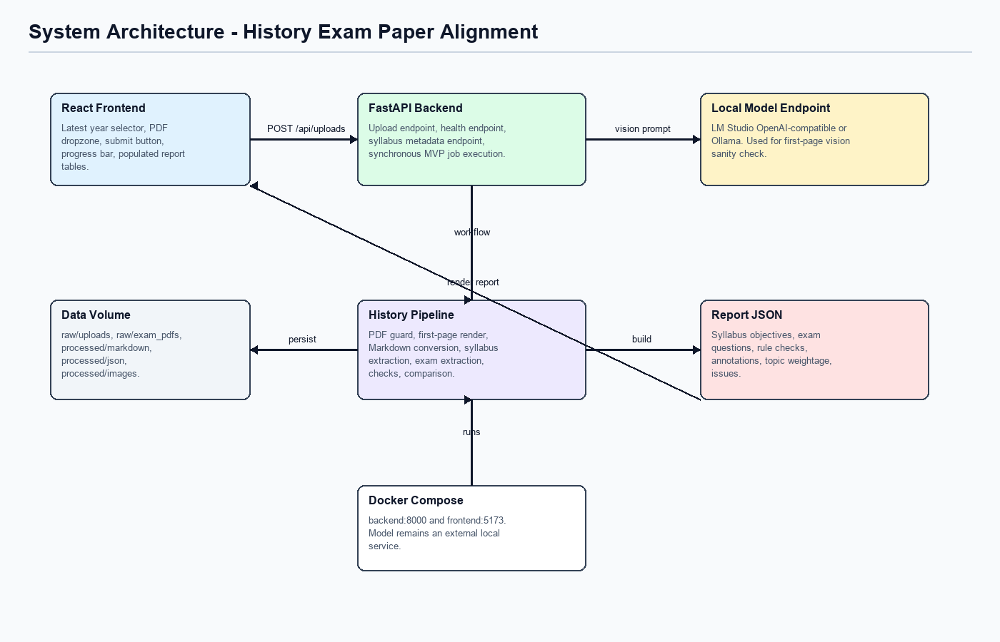

# System Architecture

## Runtime Components

| Component | Path | Responsibility |
|---|---|---|
| React frontend | `frontend/` | PDF upload interface, progress state, report rendering, JSON/DOCX download links. |
| FastAPI backend | `backend/app/main.py` | HTTP API for health, subject/syllabus metadata, upload processing, job lookup, and report retrieval. |
| Routed analysis workflow | `backend/app/src/graph/workflow.py` | `run_analysis` coordinates PDF validation, first-page classification, route resolution, extraction, rule checks, annotation, topic weightage, and report building. |
| Subject routes | `backend/app/src/subjects.py` | Selects `history_o_level_2174` for History `2174` papers or `generic_exam_subject` for unconfigured subjects. |
| Local model service | external | LM Studio OpenAI-compatible server or Ollama. The model is not bundled in Docker. |
| Data volume | `data/` | Stores raw uploads, rendered images, Markdown conversions, cached reports, syllabus metadata, and report JSON. |

## Subject Routing

The workflow renders and classifies the first page before choosing a route.

| Route | Trigger | Behavior |
|---|---|---|
| `history_o_level_2174` | `subject == History` or paper code starts with `2174/` | Loads the configured 2026 History syllabus, uses History extraction fallback, History rule checks, and History-specific structure metrics. |
| `generic_exam_subject` | Any unconfigured subject/paper code | Uses generic syllabus placeholder metadata, generic LLM/regex extraction, generic page-traceability checks, and dynamic structure metrics. |

`run_history_analysis` still exists as a compatibility alias, but new code should call `run_analysis`.

## Docker Launcher

`docker-compose.yml` defines two app services:

| Service | Port | Notes |
|---|---:|---|
| `backend` | `8000` | Runs `uvicorn backend.app.main:app`. |
| `frontend` | `5173` | Serves the built Vite app through Nginx and proxies `/api/` to `backend:8000`. |

The default model provider is `mock`, which makes the app usable without a model server. For real local model testing, set `MODEL_PROVIDER`, `MODEL_BASE_URL`, and `MODEL_NAME`, or use the Ollama variables documented in `04_local_model_testing.md`.

## Main API Surface

| Method | Endpoint | Purpose |
|---|---|---|
| `GET` | `/api/health` | Confirms the backend is running and returns supported route metadata. |
| `GET` | `/api/subjects` | Lists configured subjects and the generic fallback route. |
| `GET` | `/api/syllabus/latest?subject_code=2174` | Returns configured History syllabus metadata; other subject codes return generic unconfigured metadata. |
| `POST` | `/api/uploads` | Uploads a PDF, runs routed analysis synchronously, and returns the completed report. |
| `GET` | `/api/jobs/{job_id}` | Reads in-memory or persisted job state. |
| `GET` | `/api/jobs/{job_id}/report` | Reads persisted `comparison_report.json`. |
| `GET` | `/api/jobs/{job_id}/report.md` | Exports the report as Markdown. |
| `GET` | `/api/jobs/{job_id}/report.docx` | Exports the report as Word `.docx`. |

## Output Contract Highlights

The report is route-aware:

- `structure_metrics` are produced by the selected route and rendered directly by the frontend and exports.
- `download_filename_base` is generated by the backend.
- `QuestionAnnotation` no longer includes a confidence score.
- `QuestionAnnotation.evidence_page_numbers` carries page traceability for mapped questions and referenced sources.
