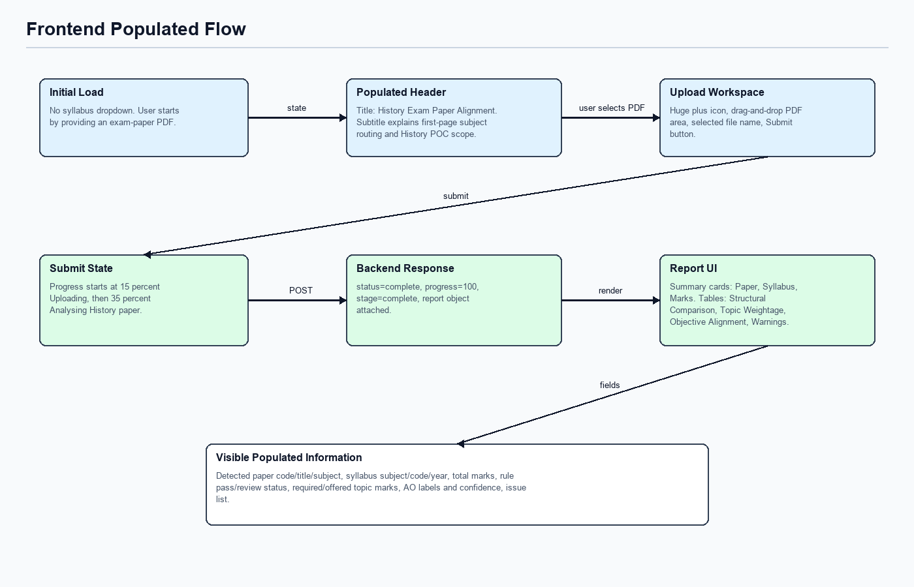

# Frontend Flow

## First Render

The frontend does not expose a syllabus-year dropdown. The user supplies an exam-paper PDF, and the backend scans the first page to identify the subject route.

Current populated values:

| UI Area | Populated Information |
|---|---|
| Header title | `Exam Paper Alignment` |
| Header subtitle | `Upload an exam paper PDF. The backend scans the first page, selects the best subject route, and compares the paper against the configured syllabus baseline.` |
| Dropzone | Large plus icon, PDF drag-and-drop area, selected filename once chosen. |
| Submit button | Enabled after a PDF file is selected. |

## Submit Flow

1. User drops or selects a PDF.
2. Frontend rejects non-PDF files before upload.
3. User clicks `Submit`.
4. Progress state changes to `Uploading` at 15 percent.
5. Progress state changes to `Analysing exam paper` at 35 percent.
6. Frontend posts to `/api/uploads`.
7. Backend returns `status=complete`, `progress=100`, `stage=complete`, and `report`.
8. Frontend renders the routed report.

The frontend does not choose the subject. Subject routing happens in the backend after first-page classification.

## Populated Report Sections

The report component renders these sections from `comparison_report.json`:

| Section | Source Fields |
|---|---|
| Download actions | `download_filename_base`, `job_id`. |
| Summary cards | `exam_paper.paper_code`, `exam_paper.paper_title`, `syllabus.subject`, `syllabus.subject_code`, `syllabus.year`, `exam_paper.total_marks`. |
| Extracted Paper Structure | Backend-provided `structure_metrics[]`; frontend falls back to subject, total marks, question count, and source count if missing. |
| Checks Requiring Attention | Failed `rule_checks[]` only, using `rule_id`, `expected`, and `observed`. |
| Topic Weightage | `topic_weightage[].topic`, `required_marks`, `offered_marks`. |
| Objective Alignment | `annotations[].question_id`, `predicted_objectives`, `predicted_topic`, `evidence_page_numbers`. |
| Warnings And Errors | `issues[].severity`, `code`, `message`, `reason`. |

## Traceability UX

The frontend no longer displays confidence scores. Instead, the Objective Alignment table displays evidence page numbers supplied by the backend. These page numbers come from extracted question pages and referenced source/stimulus pages.

If page numbers are not available, the table displays `Not recorded`, which is a traceability gap rather than a low-confidence score.

## Frontend Files

| File | Role |
|---|---|
| `frontend/src/App.tsx` | Top-level state, upload submission, progress state, routed report display. |
| `frontend/src/components/UploadDropzone.tsx` | PDF-only upload area. |
| `frontend/src/components/ProgressBar.tsx` | Stage and percentage display. |
| `frontend/src/components/ComparisonReport.tsx` | Technical report rendering from backend-provided fields. |
| `frontend/src/api/client.ts` | Fetch helpers for backend API calls. |
