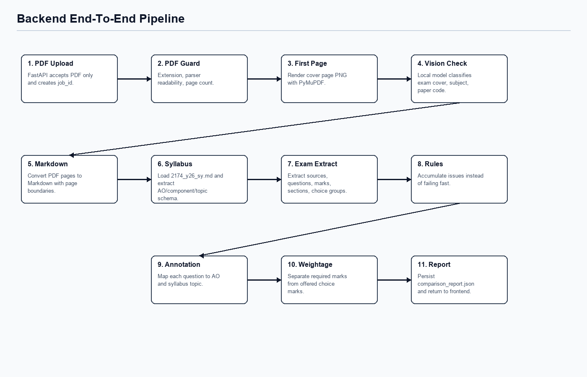

# Backend Pipeline

## Requirement Fit

The backend must produce traceable, structured claims that can be checked against both the syllabus baseline and the uploaded paper. It does not emit a free-form verdict such as "this exam is good"; it emits extracted structure, rule checks, topic/objective mappings, page traceability, and issues.

The current implementation supports:

- a production-style History `2174` route for the configured syllabus assets;
- a generic fallback route for unconfigured subjects, so non-History papers are not incorrectly judged against History rules.

## End-To-End Steps

| Step | Module | Output |
|---:|---|---|
| 1 | `backend/app/api/routes_upload.py` | Receives PDF upload, creates `job_id`, stores original PDF. |
| 2 | `src/ingestion/pdf_guard.py` | Accumulates PDF validation issues. |
| 3 | `src/ingestion/page_renderer.py` | Renders first page to `data/processed/images/{job_id}/page_001.png`. |
| 4 | `src/ingestion/first_page_classifier.py` | Uses local model/mock provider to classify first page and extract subject/paper metadata. |
| 5 | `src/subjects.py` | Resolves `history_o_level_2174` or `generic_exam_subject`. |
| 6 | `src/ingestion/pdf_to_markdown.py` | Converts PDF text to page-bounded Markdown. |
| 7 | selected route | Loads a configured `SyllabusDocument` or generic unconfigured syllabus placeholder. |
| 8 | selected route | Extracts `ExamPaper` using LLM extraction when available, with route-specific fallback. |
| 9 | selected route | Builds `RuleCheckResult[]`, route-specific `structure_metrics[]`, and issue records. |
| 10 | `src/comparison/semantic_matcher.py` | Builds per-question `QuestionAnnotation[]` using LLM-backed mapping for real model clients and deterministic fallback otherwise. |
| 11 | `src/comparison/topic_weightage.py` | Calculates required marks vs offered marks by topic. |
| 12 | `src/reporting/report_builder.py` | Builds and persists `ComparisonReport`. |

## Subject Routes

| Route | Current behavior |
|---|---|
| `history_o_level_2174` | Loads `2174_y26_sy.md`/`.pdf`, runs History extraction fallback, applies History Paper 1/Paper 2 rules, emits History-specific structure metrics such as Section A marks and Section B offered marks. |
| `generic_exam_subject` | Creates placeholder syllabus metadata from first-page subject/paper data, uses generic extraction fallback when no model output is available, checks basic extraction and page traceability, and emits generic structure metrics. |

The generic route is intentionally conservative. It prevents unrelated subjects from being processed as History, but production-grade alignment still requires subject-specific syllabus assets and rule packs.

## Traceability Chain

Every final claim should be traceable through intermediate objects:

| Final claim type | Trace path |
|---|---|
| "Paper has N marks" | `comparison_report.json` -> `exam_paper.total_marks` -> extracted `ExamQuestion.marks` -> `exam.md` -> original PDF. |
| "Question maps to objective/topic" | `annotations[]` -> `evidence_page_numbers` -> `ExamQuestion.page_number` and referenced `SourceItem.page_number` -> `exam.md` -> original PDF. |
| "Rule failed" | `rule_checks[]` -> route rule implementation -> `exam_paper` and `syllabus`. |
| "Topic is required/offered" | `topic_weightage[]` -> `annotations[]` -> `ExamQuestion.marks`, `choice_group`, and route compulsory-choice policy. |

`QuestionAnnotation` no longer contains confidence. Traceability is represented through `evidence_page_numbers` and evidence snippets.

## Alignment Logic

Question-to-syllabus mapping is route-aware:

| Mode | Behavior |
|---|---|
| Real local model provider | `annotate_question` renders `map_question_to_syllabus.j2` per question and asks the model to map objectives/topics with page-number evidence. |
| Mock provider or failed model mapping | Deterministic fallback maps known History keywords and otherwise falls back to syllabus candidates. |

For History `2174`, deterministic fallback still maps source-based Section A prompts to AO1/AO3 and other prompts to AO1/AO2. For generic subjects, route behavior is intentionally minimal until a real subject syllabus and rules are configured.

## Topic-Weightage Logic

Topic weightage distinguishes:

| Weightage view | Meaning |
|---|---|
| Required marks | Marks compulsory for every candidate under the route's current policy. |
| Offered marks | Marks available in the paper's question menu, including alternatives. |
| Candidate-experienced notes | Route-specific explanation of compulsory vs offered marks. |

History keeps the original Section A required / Section B offered behavior. Generic subjects treat non-choice questions as required and choice-group alternatives as offered until a subject-specific policy is configured.

## Error Handling

The pipeline does not fail fast for content mismatch. Validation mismatches are appended as `ValidationIssue` records and returned in the report.

Examples:

| Condition | Behavior |
|---|---|
| First page is not classified as an exam paper | Add an `ERROR` issue and continue if extraction is still possible. |
| Subject is not configured | Route to `generic_exam_subject` and add an informational issue that syllabus/rules are unconfigured. |
| Total marks mismatch on configured route | Add an `ERROR` rule-check issue. |
| Source count exceeds a configured limit | Add a `WARNING` issue. |
| LLM-extracted source lacks page number | Reject LLM extraction and use route fallback. |

## Persisted Artifacts

| Artifact | Path Pattern |
|---|---|
| Original upload | `data/raw/uploads/{job_id}/original.pdf` |
| Rendered first page | `data/processed/images/{job_id}/page_001.png` |
| Markdown extraction | `data/processed/markdown/{job_id}/exam.md` |
| Raw model response | `data/processed/json/{job_id}/raw_model_response.json` |
| Raw extraction artifact | `data/processed/json/{job_id}/raw_extraction.json` |
| Extracted exam structure | `data/processed/json/{job_id}/exam_structure.json` |
| Final report | `data/processed/json/{job_id}/comparison_report.json` |
| Audit log | `data/processed/json/{job_id}/audit_log.json` |
