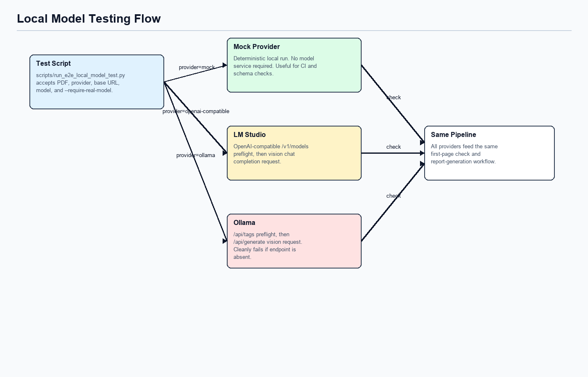

# Local Model Testing



## Test Script

Use:

```bash
python3 scripts/run_e2e_local_model_test.py --pdf data/raw/exam_pdfs/2174_specimen_paper_1.pdf --provider mock
```

The script runs the same end-to-end backend workflow used by the API and prints:

| Printed Field | Meaning |
|---|---|
| `job_id` | Generated analysis job id. |
| `report` | Path to persisted `comparison_report.json`. |
| `provider` | Model provider used for first-page classification and any model-backed extraction/mapping. |
| `subject` | Extracted/classified subject. |
| `total_marks` | Extracted candidate paper total. |
| `issues` | Count of accumulated issues. |
| `topic_weightage` | Required/offered marks by topic. |

## Mock Provider

`--provider mock` is deterministic and does not require a model server. It classifies the first page as History `2174/01` for local tests, uses route fallbacks, and keeps output reproducible.

Mock mode is best for regression tests and smoke checks. It does not exercise real LLM question-to-syllabus mapping.

## LM Studio / OpenAI-Compatible

Command shape:

```bash
python3 scripts/run_e2e_local_model_test.py \
  --pdf data/raw/exam_pdfs/2174_specimen_paper_1.pdf \
  --provider openai-compatible \
  --base-url http://localhost:1234/v1 \
  --model qwen/qwen3.6-35b-a3b \
  --require-real-model
```

`--require-real-model` checks `/v1/models` before running the full pipeline.

With a real OpenAI-compatible provider, model calls can be used for:

- first-page vision classification;
- structured exam extraction;
- per-question syllabus/topic/objective mapping through `map_question_to_syllabus.j2`.

If structured extraction is rejected, the selected route falls back to regex extraction. LLM-extracted sources must include `page_number`; missing source page numbers trigger fallback.

## Ollama

Command shape:

```bash
python3 scripts/run_e2e_local_model_test.py \
  --pdf data/raw/exam_pdfs/2174_specimen_paper_1.pdf \
  --provider ollama \
  --base-url http://localhost:11434 \
  --model qwen2.5vl:latest \
  --require-real-model
```

`--require-real-model` checks `/api/tags` before running. If Ollama is not running, the script exits with a clean connection message.

## Traceability Expectations

Reports no longer include annotation confidence. For model-backed annotation, the model must return `evidence_page_numbers` for each `QuestionAnnotation`. The backend also derives page evidence from extracted question/source pages when falling back to deterministic mapping.

Useful checks after a run:

```bash
python3 - <<'PY'
import json
from pathlib import Path

report = json.loads(Path("data/processed/json/<job_id>/comparison_report.json").read_text())
print(report["annotations"][0]["evidence_page_numbers"])
print("confidence" in report["annotations"][0])
PY
```
