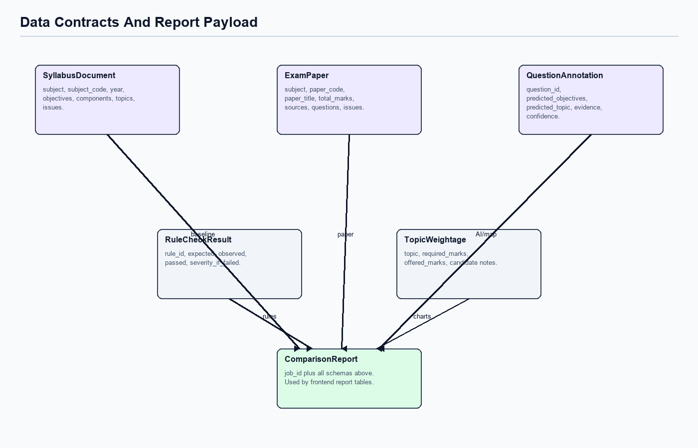

# Data Contracts



## Comparison Report

The frontend consumes `ComparisonReport`, persisted at:

```text
data/processed/json/{job_id}/comparison_report.json
```

Top-level fields:

| Field | Purpose |
|---|---|
| `job_id` | Traceable run identifier. |
| `syllabus` | Configured subject syllabus baseline, or generic unconfigured placeholder for fallback routes. |
| `exam_paper` | Extracted uploaded paper structure. |
| `rule_checks` | Route-specific expected-vs-observed checks. |
| `annotations` | Per-question objective/topic mapping with page-number evidence. |
| `topic_weightage` | Required/offered marks by syllabus topic. |
| `structure_metrics` | Backend-generated rows for the Extracted Paper Structure table. |
| `download_filename_base` | Backend-generated base filename for JSON/DOCX downloads. |
| `summary_findings` | Short generated findings for report display. |
| `chart_payloads` | Ready-to-render chart/table payloads. |
| `issues` | Accumulated validation and rule issues. |

## Key Schemas

| Schema | File | Notes |
|---|---|---|
| `ValidationIssue` | `backend/app/schemas/base.py` | Shared issue object. |
| `SyllabusDocument` | `backend/app/schemas/syllabus.py` | Objectives, components, topics, and syllabus source metadata. |
| `ExamPaper` | `backend/app/schemas/exam.py` | Metadata, sources, questions, marks, and page numbers. |
| `FirstPageCheck` | `backend/app/schemas/exam.py` | First-page route metadata; no confidence score. |
| `QuestionAnnotation` | `backend/app/schemas/comparison.py` | Question-to-objective/topic mapping with `evidence_page_numbers`; no confidence score. |
| `RuleCheckResult` | `backend/app/schemas/comparison.py` | Expected vs observed checks. |
| `TopicWeightage` | `backend/app/schemas/comparison.py` | Required vs offered marks. |
| `StructureMetric` | `backend/app/schemas/comparison.py` | Label/value rows emitted by the selected route. |
| `ComparisonReport` | `backend/app/schemas/comparison.py` | Final frontend/export contract. |

## Question Annotation

`QuestionAnnotation` currently contains:

| Field | Meaning |
|---|---|
| `question_id` | ID from `ExamQuestion.question_id`. |
| `predicted_objectives` | Objective IDs or labels mapped from the syllabus context. |
| `predicted_topic` | Human-readable topic label. |
| `syllabus_topic_id` | Optional syllabus topic ID. |
| `evidence_from_question` | Extracted question evidence snippet. |
| `evidence_from_syllabus` | Syllabus evidence snippet or selected topic text. |
| `evidence_page_numbers` | Page numbers supporting the mapping, derived from question/source pages or returned by the LLM. |
| `ambiguity_notes` | Optional notes when multiple mappings are plausible. |

There is intentionally no `confidence` field. The product now emphasizes traceability through page numbers over scalar confidence.

## Source And Page Traceability

`ExamQuestion.page_number` and `SourceItem.page_number` are important for auditability.

| Extraction path | Page-number behavior |
|---|---|
| History fallback extraction | Attaches page numbers from Markdown `## Page N` markers to questions and sources. |
| Generic fallback extraction | Attaches page numbers to bracket-mark questions it can parse. |
| LLM extraction | Requires every extracted source to include `page_number`; missing source page numbers reject the LLM output and trigger fallback. |
| Annotation | Emits `evidence_page_numbers` using question/source page data or model output. |

## Structure Metrics

The frontend and exports render `structure_metrics[]` directly. This keeps subject-specific structure logic in the backend route rather than duplicating it in UI code.

Example:

```json
[
  {"label": "Subject", "value": "History"},
  {"label": "Total candidate marks", "value": 50},
  {"label": "Section A marks", "value": 30},
  {"label": "Source count", "value": 6}
]
```

Generic routes may emit rows such as subject, total marks, question count, source count, and per-section marks.

## Frontend Field Usage

| UI Section | JSON Fields |
|---|---|
| Paper summary | `exam_paper.paper_code`, `exam_paper.paper_title`, `exam_paper.total_marks`. |
| Syllabus summary | `syllabus.subject`, `syllabus.subject_code`, `syllabus.year`. |
| Extracted Paper Structure | `structure_metrics`. |
| Checks Requiring Attention | Failed `rule_checks`. |
| Topic Weightage | `topic_weightage`. |
| Objective Alignment | `annotations[].question_id`, `predicted_objectives`, `predicted_topic`, `evidence_page_numbers`. |
| Warning panel | `issues`. |
| Download links | `download_filename_base`, `job_id`. |

## API Metadata Contracts

| Endpoint | Response Notes |
|---|---|
| `/api/health` | Returns `ok`, `supported_routes`, and `default_syllabus_year`. |
| `/api/subjects` | Returns configured History `2174` and the generic fallback route metadata. |
| `/api/syllabus/latest?subject_code=2174` | Returns configured History syllabus metadata. |
| `/api/syllabus/latest?subject_code=<other>` | Returns generic unconfigured metadata for that subject code. |
